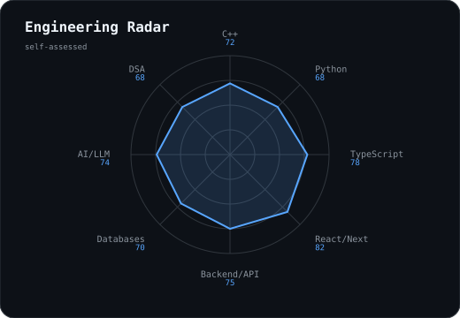
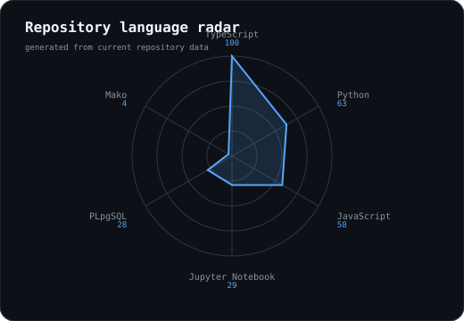
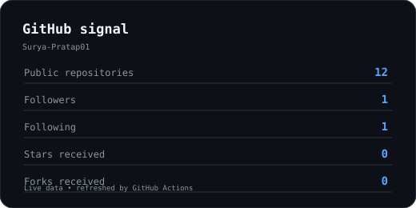
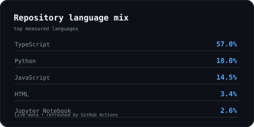
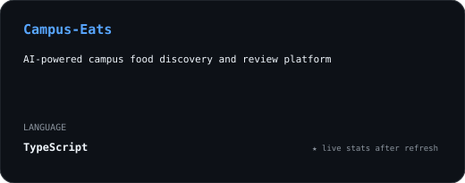
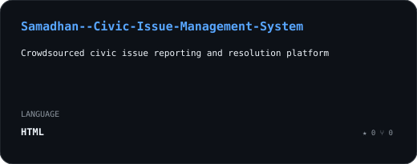
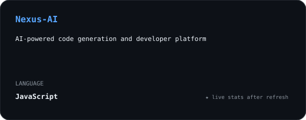
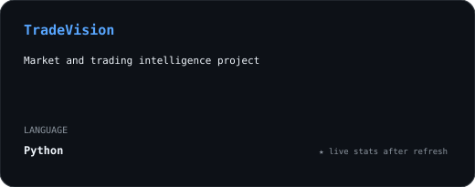

<div align="center">


# SURYA PRATAP SINGH

### `Full-Stack Developer` · `AI/ML Builder` · `Problem Solver`


<br>

<a href="https://www.linkedin.com/in/surya-pratap-a5a855312/"></a>
<a href="https://leetcode.com/u/Surya_Pratap01/"></a>
<a href="mailto:suryarathore051@gmail.com"></a>
<a href="https://github.com/Surya-Pratap01"></a>


</div>

---

## `01 / about`

```text
$ cat about.txt

Hi, I'm Surya — a Computer Science student who likes building
things that move from idea → code → usable product.

→ Currently building    Campus Eats + full-stack applications
→ Learning              AI/ML + DSA
→ Exploring             LLMs, AI Agents + backend systems
→ Improving             System design + open source
```

---

## `02 / toolkit`

<div align="center">

</div>

<sub>Tools I actively use or am intentionally learning.</sub>

---

## `03 / engineering signal`

<table>
<tr>
<td width="50%" align="center">

<picture>
<source media="(prefers-color-scheme: dark)" srcset="assets/radar-dark.svg">
<source media="(prefers-color-scheme: light)" srcset="assets/radar-light.svg">

</picture>

</td>
<td width="50%" align="center">

<picture>
<source media="(prefers-color-scheme: dark)" srcset="assets/radar-langs-dark.svg">
<source media="(prefers-color-scheme: light)" srcset="assets/radar-langs-light.svg">

</picture>

</td>
</tr>
</table>

> **Left:** current self-assessment. **Right:** generated from actual repository language usage.

---

## `04 / contribution system`


### Contribution snake

<picture>
<source media="(prefers-color-scheme: dark)" srcset="https://raw.githubusercontent.com/Surya-Pratap01/Surya-Pratap01/output/github-snake-dark.svg">
<source media="(prefers-color-scheme: light)" srcset="https://raw.githubusercontent.com/Surya-Pratap01/Surya-Pratap01/output/github-snake.svg">

</picture>

<sub>Generated from the real GitHub contribution calendar.</sub>

---

## `05 / github signal`

<table>
<tr>
<td width="50%">

<picture>
<source media="(prefers-color-scheme: dark)" srcset="assets/stats-dark.svg">
<source media="(prefers-color-scheme: light)" srcset="assets/stats-light.svg">

</picture>

</td>
<td width="50%">

<picture>
<source media="(prefers-color-scheme: dark)" srcset="assets/languages-dark.svg">
<source media="(prefers-color-scheme: light)" srcset="assets/languages-light.svg">

</picture>

</td>
</tr>
</table>

<sub>Local SVGs are regenerated by GitHub Actions instead of depending on a third-party stats-image server.</sub>

---

## `06 / selected builds`

<table>
<tr>
<td width="50%" align="center">

<a href="https://github.com/Surya-Pratap01/Campus-Eats">
<picture><source media="(prefers-color-scheme: dark)" srcset="assets/card-Campus-Eats-dark.svg"><source media="(prefers-color-scheme: light)" srcset="assets/card-Campus-Eats-light.svg"></picture>
</a>

</td>
<td width="50%" align="center">

<a href="https://github.com/Surya-Pratap01/Samadhan--Civic-Issue-Management-System">
<picture><source media="(prefers-color-scheme: dark)" srcset="assets/card-Samadhan--Civic-Issue-Management-System-dark.svg"><source media="(prefers-color-scheme: light)" srcset="assets/card-Samadhan--Civic-Issue-Management-System-light.svg"></picture>
</a>

</td>
</tr>
<tr>
<td width="50%" align="center">

<a href="https://github.com/Surya-Pratap01/Nexus-AI">
<picture><source media="(prefers-color-scheme: dark)" srcset="assets/card-Nexus-AI-dark.svg"><source media="(prefers-color-scheme: light)" srcset="assets/card-Nexus-AI-light.svg"></picture>
</a>

</td>
<td width="50%" align="center">

<a href="https://github.com/Surya-Pratap01/TradeVision">
<picture><source media="(prefers-color-scheme: dark)" srcset="assets/card-TradeVision-dark.svg"><source media="(prefers-color-scheme: light)" srcset="assets/card-TradeVision-light.svg"></picture>
</a>

</td>
</tr>
</table>

| Build | What it is | Stack |
|---|---|---|
| [Campus Eats](https://github.com/Surya-Pratap01/Campus-Eats) | AI-powered campus food discovery, menus, ratings and reviews | TypeScript · React · Next.js |
| [Samadhan](https://github.com/Surya-Pratap01/Samadhan--Civic-Issue-Management-System) | Crowdsourced civic issue reporting and resolution | Flask · SQLite · JavaScript · Leaflet |
| [Nexus AI](https://github.com/Surya-Pratap01/Nexus-AI) | AI-powered code generation / developer platform | Next.js · TypeScript · PostgreSQL · Prisma · Gemini |
| [TradeVision](https://github.com/Surya-Pratap01/TradeVision) | Market / trading intelligence project | Python · AI · Data |

---

## `07 / currently`

```text
BUILDING   → Campus Eats + full-stack applications
LEARNING   → AI/ML + DSA
EXPLORING  → LLMs + AI Agents
IMPROVING  → System Design + Open Source
```

---

## `08 / achievements`

- 🏆 **Smart India Hackathon 2025** — Top 200 in internal selection out of ~600 teams
- 💻 Built and deployed multiple full-stack applications
- 🤖 Working with Generative AI, LLMs and AI Agents
- 🏐 Competitive university-level volleyball
- 🚀 Participated in university / industry hackathons and engineering challenges

---

## `09 / connect`

<div align="center">

**Building something interesting? Let's connect.**

<a href="https://www.linkedin.com/in/surya-pratap-a5a855312/">LinkedIn</a>
&nbsp; · &nbsp;
<a href="https://leetcode.com/u/Surya_Pratap01/">LeetCode</a>
&nbsp; · &nbsp;
<a href="mailto:suryarathore051@gmail.com">Email</a>
&nbsp; · &nbsp;
<a href="https://github.com/Surya-Pratap01">GitHub</a>

<br><br>
<sub>Designed as a living engineering profile — not a wall of badges.</sub>

</div>
