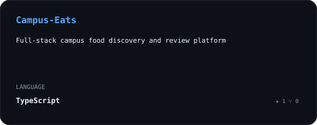
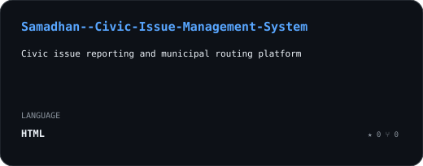
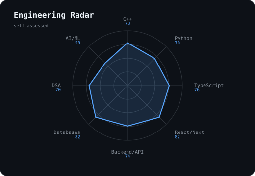
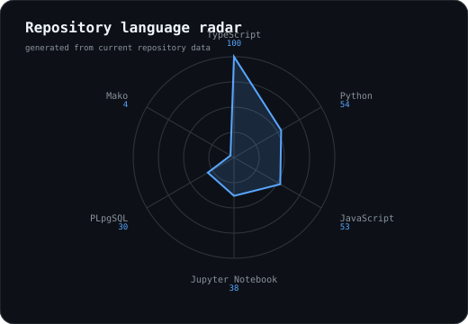
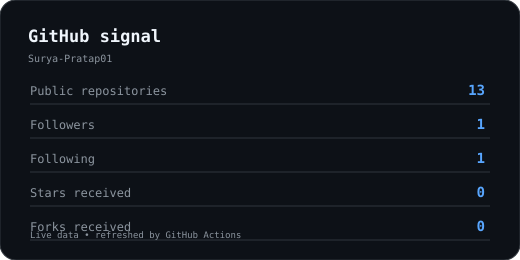
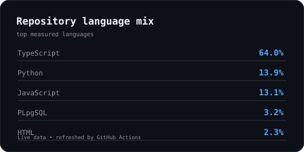

<div align="center">


# SURYA PRATAP SINGH RATHOD

### `Computer Science Student` · `Full-Stack Developer` · `AI/ML Learner`

<p>
  <a href="https://www.linkedin.com/in/surya-pratap-a5a855312/"></a>
  <a href="https://leetcode.com/u/Surya_Pratap01/"></a>
  <a href="mailto:suryarathore051@gmail.com"></a>
  <a href="https://github.com/Surya-Pratap01"></a>
</p>

</div>

---

## `01 / profile`

Computer Science and Engineering student at Bennett University focused on building and shipping full-stack applications.

- **Building:** production-oriented web applications with Next.js, TypeScript and PostgreSQL
- **Learning:** AI/ML and Data Structures & Algorithms
- **Working with:** React, Next.js, Supabase, FastAPI, PostgreSQL/PostGIS and Vercel
- **Focus:** full-stack development, backend systems and database-driven applications
- **Beyond code:** Technical Head at Data Science Society and Vice-Captain of the Men's Volleyball Team

---

## `02 / technical stack`

<div align="center">

</div>

### Core

**Languages:** C++ · Python · TypeScript · JavaScript · SQL  
**Frontend:** React · Next.js · HTML/CSS · Tailwind CSS  
**Backend & Data:** Node.js · FastAPI · PostgreSQL/PostGIS · Supabase  
**Tools:** Git · GitHub · VS Code · Vercel  
**CS Fundamentals:** Data Structures & Algorithms · OOP · DBMS · Operating Systems

---

## `03 / featured projects`

### CampusEats — Campus Food Discovery & Review Platform
**Solo Project** · Next.js 15 · TypeScript · Supabase · PostgreSQL · Tailwind CSS · Vercel

- Built and deployed the full-stack platform for browsing campus outlets and menus and rating items across taste, hygiene, quantity and value for money.
- Implemented Supabase email/password authentication with Bennett University email validation and PostgreSQL Row-Level Security for student and admin access.
- Designed a relational schema covering profiles, outlets, menu items and ratings, with database triggers for profile creation and timestamp updates.
- Built an admin panel for managing outlets, menu items and ratings; tested with approximately 8 student accounts.

**[Repository](https://github.com/Surya-Pratap01/Campus-Eats)**

---

### Bhoomi Sanket — Land Acquisition Delay Monitoring Platform
**SIH 2026 · Team Leader · Ranked 62nd among 600+ teams in the internal round**  
Next.js 14 · TypeScript · PostgreSQL/PostGIS · Supabase · React-Leaflet · FastAPI

- Designed the monorepo architecture and shared TypeScript contracts for stage-aware land acquisition project tracking.
- Implemented project management, alerts, admin and audit-log modules using PostgreSQL/PostGIS and Supabase Row-Level Security.
- Integrated the application dashboard and GIS map into a Vercel-deployed prototype using synthetic demo data.
- Defined a FastAPI interface for future ML-based risk scoring. **ML inference is not connected and the prototype does not produce predictive scores.**
- Led the team through manual testing, final integration and the pitch; qualified for the next-stage presentation round.

---

### Samadhan — Civic Issue Reporting Platform
**SIH 2025 · Team Leader** · Flask · Python · SQLite · SQLAlchemy · JavaScript · Leaflet.js · Chart.js

- Designed the database schema for issues, departments and votes, including a unique constraint to prevent duplicate votes per device.
- Integrated the Flask backend with Leaflet.js mapping and Chart.js analytics views.
- Implemented GPS-based issue reporting with persistent database storage across page refreshes.
- Led architecture, design and final integration while collaborating on rule-based routing to six municipal departments and automatic priority assignment.

**[Repository](https://github.com/Surya-Pratap01/Samadhan--Civic-Issue-Management-System)**

---

## `04 / project snapshot`

<table>
<tr>
<td width="50%" align="center">
<a href="https://github.com/Surya-Pratap01/Campus-Eats"><picture><source media="(prefers-color-scheme: dark)" srcset="assets/card-Campus-Eats-dark.svg"><source media="(prefers-color-scheme: light)" srcset="assets/card-Campus-Eats-light.svg"></picture></a>
</td>
<td width="50%" align="center">
<a href="https://github.com/Surya-Pratap01/Samadhan--Civic-Issue-Management-System"><picture><source media="(prefers-color-scheme: dark)" srcset="assets/card-Samadhan--Civic-Issue-Management-System-dark.svg"><source media="(prefers-color-scheme: light)" srcset="assets/card-Samadhan--Civic-Issue-Management-System-light.svg"></picture></a>
</td>
</tr>
</table>


---

## `05 / engineering signal`

<table>
<tr>
<td width="50%" align="center">

<picture>
<source media="(prefers-color-scheme: dark)" srcset="assets/radar-dark.svg">
<source media="(prefers-color-scheme: light)" srcset="assets/radar-light.svg">

</picture>

</td>
<td width="50%" align="center">

<picture>
<source media="(prefers-color-scheme: dark)" srcset="assets/radar-langs-dark.svg">
<source media="(prefers-color-scheme: light)" srcset="assets/radar-langs-light.svg">

</picture>

</td>
</tr>
</table>

> **Left:** personal skill self-assessment. **Right:** generated from language usage across public repositories.

---

## `06 / leadership & impact`

**Technical Head — Data Science Society, Bennett University** · Sep 2026 – Present  
Lead the technical function and 3 sub-heads within a ~25-member core; enhanced the society website, conducted ~80 junior-core technical interviews and mentor 10–15 juniors.

**Vice-Captain — Men's Volleyball Team, Bennett University** · Aug 2025 – Present  
Coordinate practice, tournament logistics and coach/university communication, and lead the team in the captain's absence. The team has secured **9 inter-university podium finishes** from 2024–2026: 1 Gold, 7 Silver and 1 Bronze.

**Batch Representative — Batch 48, Bennett University** · Aug 2024 – Present  
Act as the liaison between students and faculty/administration for registrations, forms and student issues.

---

## `07 / achievements & certifications`

- **Smart India Hackathon 2026:** Ranked **62nd among 600+ teams** in the internal round; qualified for the next-stage presentation round.
- **Smart India Hackathon 2025:** Top **200 of 600+ teams** in the internal round.
- **University Volleyball:** 9 inter-university podium finishes across 2024–2026 — 1 Gold, 7 Silver, 1 Bronze.
- **Certifications:** Introduction to Modern Database Systems (Saylor Academy) · AWS Academy Cloud Foundations.

---

## `08 / github activity`

<table>
<tr>
<td width="50%">

<picture>
<source media="(prefers-color-scheme: dark)" srcset="assets/stats-dark.svg">
<source media="(prefers-color-scheme: light)" srcset="assets/stats-light.svg">

</picture>

</td>
<td width="50%">

<picture>
<source media="(prefers-color-scheme: dark)" srcset="assets/languages-dark.svg">
<source media="(prefers-color-scheme: light)" srcset="assets/languages-light.svg">

</picture>

</td>
</tr>
</table>


### Contribution activity

<picture>
<source media="(prefers-color-scheme: dark)" srcset="https://raw.githubusercontent.com/Surya-Pratap01/Surya-Pratap01/output/github-snake-dark.svg">
<source media="(prefers-color-scheme: light)" srcset="https://raw.githubusercontent.com/Surya-Pratap01/Surya-Pratap01/output/github-snake.svg">

</picture>

---

## `09 / currently`

```text
BUILDING   → CampusEats + full-stack applications
LEARNING   → AI/ML + Data Structures & Algorithms
EXPLORING  → Backend systems + practical AI applications
IMPROVING  → System design + engineering fundamentals
```

---

## `10 / connect`

<div align="center">

**Open to internships, engineering opportunities and interesting technical collaborations.**

<a href="https://www.linkedin.com/in/surya-pratap-a5a855312/">LinkedIn</a>
&nbsp; · &nbsp;
<a href="https://leetcode.com/u/Surya_Pratap01/">LeetCode</a>
&nbsp; · &nbsp;
<a href="mailto:suryarathore051@gmail.com">Email</a>
&nbsp; · &nbsp;
<a href="https://github.com/Surya-Pratap01">GitHub</a>

</div>
